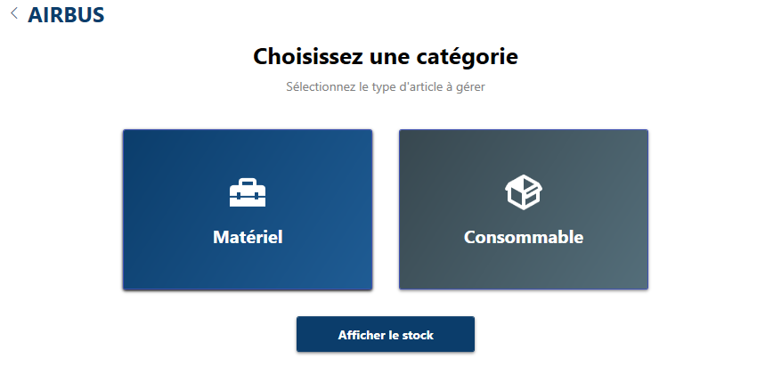
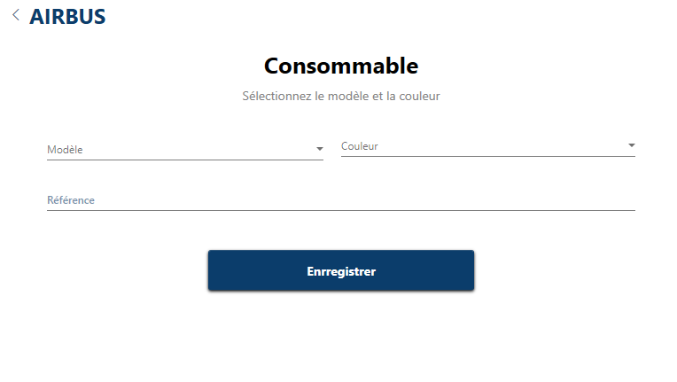
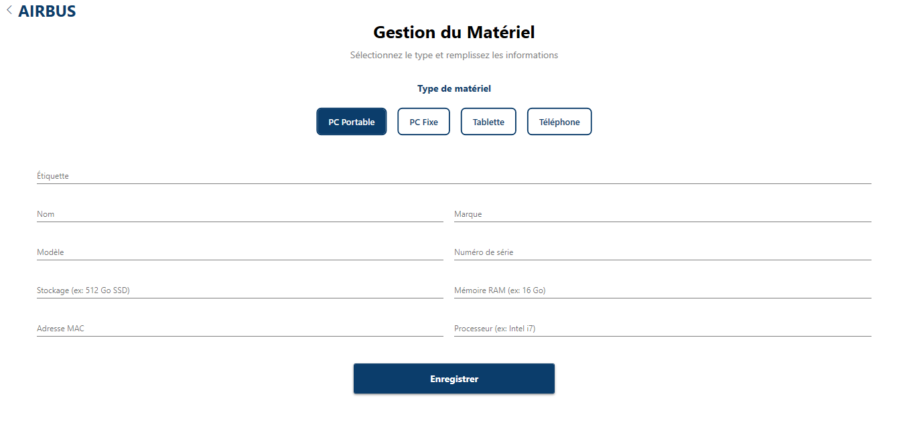
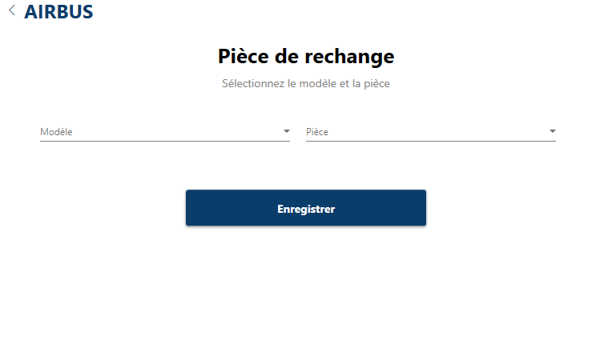
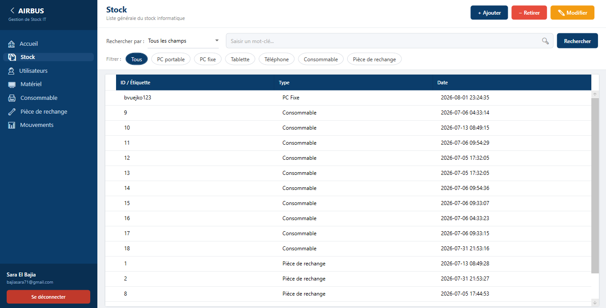
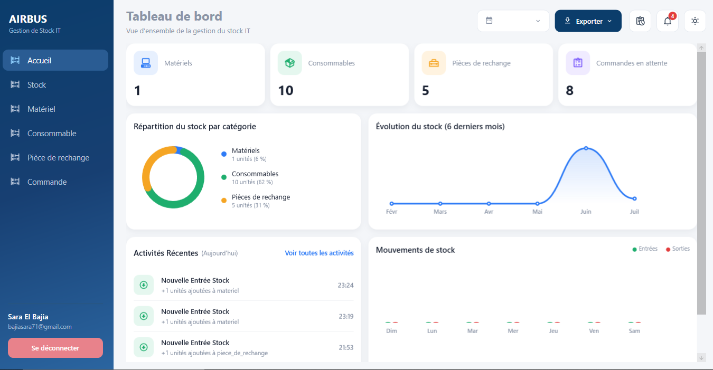
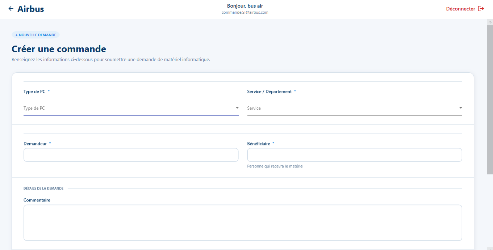

# Gestion de Stock du Matériel

Application desktop de gestion de stock développée avec **C#**, **WPF** et **MySQL**.

## 📌 Description

Cette application permet de gérer efficacement le stock informatique d'une organisation.

Elle centralise la gestion des matériels, des consommables, des pièces de rechange et des commandes à travers une interface desktop moderne et intuitive.

## ✨ Fonctionnalités

- 📦 Gestion du matériel informatique
- 🖨️ Gestion des consommables
- 🔧 Gestion des pièces de rechange
- ➕ Ajout de matériel et d'articles
- ✏️ Modification des informations
- ➖ Retrait du stock
- 🔍 Recherche et filtrage
- 📊 Tableau de bord et statistiques
- 📈 Visualisation de l'évolution du stock
- 📋 Gestion des commandes
- 📤 Export des données vers Excel et vers pdf
- 🔐 Gestion de l'accès à l'application

## 🛠️ Technologies utilisées

| Technologie | Utilisation |

------------------------------

| C# | Langage de programmation |

| WPF | Interface graphique desktop |

| .NET | Framework de développement |

| MySQL | Base de données |

| Material Design | Design de l'interface |

| ClosedXML | Export des données vers Excel |

| iTextSharp | Génération de documents PDF |

| Git | Gestion des versions |

| GitHub | Hébergement du projet |


## 🏗️ Architecture

Le projet utilise une organisation basée sur le modèle **MVVM (Model-View-ViewModel)** afin de séparer la logique métier, l'interface utilisateur et les données.

## 🗄️ Base de données

L’application utilise MySQL pour assurer le stockage et la gestion des données.

La base de données permet notamment de gérer les informations relatives aux :

* 👤 Utilisateurs
* 💻 Matériels informatiques
* 🖨️ Consommables
* 🔧 Pièces de rechange
* 📋 Commandes
* 📦 Mouvements de stock

L’application communique avec la base de données à travers un service dédié.

🔒 Les informations sensibles de connexion à la base de données ne sont pas publiées dans ce repository.

## 📊 Gestion du stock

L’application permet de gérer les différents éléments du stock à travers des interfaces dédiées.

L’utilisateur peut notamment :

* Ajouter un élément
* Modifier ses informations
* Retirer un élément du stock
* Rechercher un élément
* Filtrer les résultats
* Consulter les informations détaillées
* Supprimer un élément
* Suivre les mouvements de stock lors de la validation des commandes

## 📈 Tableau de bord

Le tableau de bord permet d’obtenir une vue globale de l’état du stock.

Il présente notamment :

* 📦 Nombre de matériels
* 🖨️ Nombre de consommables
* 🔧 Nombre de pièces de rechange
* 📋 Nombre de commandes en attente
* 📈 Évolution du stock
* 📊 Statistiques générales
* 🔎 Filtrage par mois et par année

## 📋 Gestion des commandes

L’application permet également de gérer les demandes et les commandes liées au matériel informatique.

Les informations peuvent notamment concerner :

* Type de matériel
* Service
* Demandeur
* Bénéficiaire
* Commentaire
* Pièce jointe
* État de la demande

## 📤 Export des données

Le tableau de bord peut être exporté sous deux formats :

	•	Excel (via ClosedXML) : résumé statistique du stock
	•	PDF (via iTextSharp) : capture visuelle des graphiques du tableau de bord

Cette double exportation facilite :

  * L’analyse des données
  * Le suivi du stock
  * Le partage des informations


## 🖥️ Captures d'écran
	### 🚀 Première interface 
		
	### 🔐 Interface de connexion
		
	### 🔀 Choix de catégorie
		
	### 🖨️ Gestion des consommables
		
	### 💻 Gestion du matériel
		
	### 🔧 Gestion des pièces de rechange
		
	### 📦 Gestion du stock
		
	### 🔄 Mouvements du stock
		
	### 📋 Gestion des commandes
		
## 🎨 Interface utilisateur

L’interface graphique est développée avec WPF et utilise Material Design afin de proposer une expérience utilisateur moderne et professionnelle.

L’application comprend notamment :

* Une interface de connexion et d’inscription sécurisées, avec questions de sécurité pour la récupération du mot de passe
* Une navigation latérale
* Un tableau de bord (dashboard) présentant des indicateurs clés (KPI), une répartition du stock (donut chart), l’évolution mensuelle des entrées et un suivi journalier des mouvements
* Des interfaces de gestion du stock (matériel, consommables, pièces de rechange)
* Des tableaux de données (DataGrid) avec colonnes dynamiques selon la catégorie consultée
* Des formulaires d’ajout et de modification
* Un module de gestion des commandes de matériel, avec filtrage par statut (En attente / Validée / Refusée)
* Un système de notifications et des alertes de stock faible sur les consommables

## 🔐 Sécurité

La protection des informations sensibles constitue un élément important du projet.

Les informations de connexion à la base de données ne doivent pas être publiées sur GitHub.

Les fichiers contenant des informations sensibles sont exclus du repository à l’aide du fichier : .gitignore

La configuration locale de la base de données doit être définie séparément sur chaque environnement.

## 🚀 Installation

Prérequis

Pour exécuter le projet, il est nécessaire d’avoir :

* Windows
* Visual Studio
* .NET compatible avec le projet
* MySQL Server
* MySQL Workbench (recommandé pour gérer la base de données)

1. Cloner le repository

    git clone https://github.com/SaraBajia/Gestion_de_stock.git

2. Ouvrir le projet

    Ouvrir le fichier :
      WpfApp1.sln  - avec Visual Studio.
    
3. Installer les dépendances

    Les packages NuGet nécessaires sont définis dans le fichier :
      WpfApp1.csproj

- Les principales dépendances utilisées sont :

  * MySql.Data
  * MaterialDesignThemes
  * MaterialDesignColors
  * ClosedXML
  * iTextSharp
 
4. Configurer MySQL

    Créer et configurer la base de données MySQL localement.

    Les informations de connexion doivent être configurées localement et ne doivent pas être publiées dans le repository.

5. Exécuter l’application

   Depuis Visual Studio, sélectionner le projet comme projet de démarrage puis lancer l’application.

 ## 📁 Organisation du projet
 ```text
 Gestion_de_stock_du_materiel/
│
├── mvvm/
│   ├── Common/
│   ├── Models/
│   ├── Services/
│   └── ViewModels/
│
├── App.xaml
├── App.xaml.cs
├── MainWindow.xaml
├── MainWindow.xaml.cs
│
├── WpfApp1.csproj
├── WpfApp1.sln
├── .gitignore
└── README.md

```

## 🔄 Gestion des versions
Le projet utilise Git et GitHub pour assurer le suivi des modifications et la gestion des versions.

Les modifications peuvent être enregistrées avec :
  git add .
  git commit -m "Update project"
  git push

## 🎯 Objectifs du projet
  * Centraliser les informations relatives aux équipements informatiques dans une base de données unique ;
  * Faciliter la gestion des matériels, des consommables et des pièces de rechange ;
  * Permettre l'ajout, la modification, la suppression et la consultation des équipements ;
  * Assurer le suivi de l'état et de la disponibilité des matériels ;
  * Offrir des fonctionnalités de recherche et de filtrage afin de retrouver rapidement les informations souhaitées ;
  * Garantir une meilleure traçabilité des ressources informatiques grâce à un enregistrement fiable des données ;
  * Réduire les erreurs liées à la gestion manuelle du stock ;
  * Optimiser l'organisation du parc informatique et faciliter la prise de décision ;
  * Améliorer l'efficacité du service informatique en assurant une gestion rapide, fiable et sécurisée des équipements;

-> Cette application vise ainsi à moderniser la gestion du stock informatique, à renforcer la fiabilité des informations et à contribuer à une meilleure utilisation des ressources matérielles de l'entreprise.

## 👩‍💻 Auteur
  Sara El Bajia
  
  Projet de développement d’une application desktop de gestion de stock informatique.

⭐ Merci de visiter ce projet !
